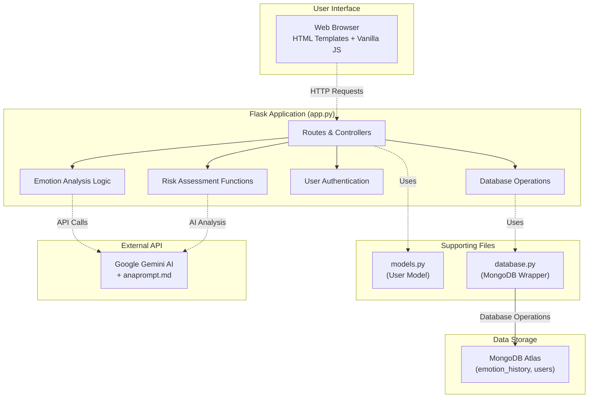

# System Architecture

This document outlines the system architecture of the project in Mermaid format, followed by a detailed explanation of its components and workflow.

---

### **คำอธิบายสถาปัตยกรรมและการทำงานของระบบ**

ระบบนี้เป็น **โปรเจคเดี่ยว (Single-Developer Project)** ที่พัฒนาโดยนักศึกษาคนเดียว ใช้สถาปัตยกรรมแบบเรียบง่าย โดยมี Flask เป็นหัวใจหลักที่รวบรวมการทำงานทั้งหมดไว้ในไฟล์เดียว (`app.py`) พร้อมไฟล์สนับสนุนเพื่อจัดระเบียบโค้ด

#### **1. User Interface (ส่วนติดต่อผู้ใช้)**

*   **ส่วนประกอบ:** HTML Templates + Vanilla JavaScript
*   **การทำงาน:** ใช้ HTML templates ใน folder `templates/` (index.html, signin.html, signup.html) ร่วมกับ JavaScript แบบ vanilla (ไม่ใช้ framework) เพื่อส่งคำขอ AJAX ไปยัง Flask routes และแสดงผลแบบ real-time

#### **2. Flask Application (ไฟล์หลัก app.py)**

เป็นหัวใจของระบบที่รวมทุกอย่างไว้ในไฟล์เดียว ประกอบด้วย:

*   **Routes & Controllers:** จัดการ URL endpoints ทั้งหมด (`/`, `/signin`, `/analyze`, `/save`, `/history90`, `/evaluate_depression`)
*   **Emotion Analysis Logic:** โค้ดสำหรับเรียก Gemini API และประมวลผลการวิเคราะห์อารมณ์
*   **Risk Assessment Functions:** ฟังก์ชัน `evaluate_depression_risk()` ที่คำนวณความเสี่ยงจากคะแนนอารมณ์
*   **User Authentication:** ระบบล็อกอิน/สมัครสมาชิกด้วย Flask-Login
*   **Database Operations:** การเรียกใช้ MongoDB เพื่อจัดการข้อมูลอารมณ์และผู้ใช้

#### **3. Supporting Files (ไฟล์สนับสนุน)**

*   **`models.py`:** กำหนด User class สำหรับ Flask-Login และจัดการ user data
*   **`database.py`:** wrapper class สำหรับ MongoDB operations เพื่อแยกโค้ดฐานข้อมูลออกจาก app.py ให้เป็นระเบียบ

#### **4. Data Storage (การจัดเก็บข้อมูล)**

*   **MongoDB Atlas:** ฐานข้อมูลหลักบนคลาวด์ (collections: emotion_history, users) ที่เก็บข้อมูลอารมณ์และข้อมูลผู้ใช้ทั้งหมด

#### **5. External API (บริการภายนอก)**

*   **Google Gemini AI:** ใช้สำหรับวิเคราะห์อารมณ์และประเมินความเสี่ยง
*   **anaprompt.md:** ไฟล์เก็บ prompt template สำหรับการวิเคราะห์ซึมเศร้า

---

### **ภาพรวมการทำงาน (Workflow)**

#### **การบันทึกและวิเคราะห์อารมณ์:**
1. ผู้ใช้เลือกอีโมจิและพิมพ์ข้อความใน HTML form แล้วกด "วิเคราะห์"
2. JavaScript ส่ง AJAX request ไปยัง `/analyze` ใน `app.py`
3. `app.py` เรียก Gemini API พร้อม prompt ภาษาไทยสำหรับวิเคราะห์อารมณ์
4. Gemini ตอบกลับด้วย JSON (emotion, summary, emotionScore)
5. JavaScript แสดงผลการวิเคราะห์ แล้วส่ง request ไปยัง `/save`
6. `app.py` บันทึกข้อมูลผ่าน `database.py` ลง MongoDB Atlas

#### **การประเมินความเสี่ยงซึมเศร้า:**
1. ผู้ใช้กด "ประเมินความเสี่ยงซึมเศร้า"
2. JavaScript ส่ง request ไปยัง `/evaluate_depression`
3. `app.py` ดึงข้อมูลประวัติ 90 วันผ่าน `database.py` จาก MongoDB Atlas
4. ทำ safe JSON serialization (แก้ปัญหา datetime objects ที่เราเพิ่งแก้)
5. โหลด prompt จาก `anaprompt.md` และรวมกับข้อมูลผู้ใช้
6. ส่งไปยัง Gemini AI เพื่อวิเคราะห์ความเสี่ยงแบบละเอียด
7. ฟังก์ชัน `evaluate_depression_risk()` คำนวณระดับความเสี่ยง (4 ระดับ)
8. ส่งผลลัพธ์กลับไปแสดงใน browser

#### **ความเป็นโปรเจคเดี่ยว:**
- **ทุกอย่างอยู่ใน app.py:** Routes, business logic, error handling รวมอยู่ในไฟล์เดียว
- **ไฟล์สนับสนุนเพื่อความเป็นระเบียบ:** models.py, database.py แยกออกมาเพื่อไม่ให้ app.py ยาวเกินไป
- **ไม่มีการแบ่งทีม:** พัฒนาและดูแลโดยนักศึกษาคนเดียว
- **Simple deployment:** รันด้วย `python app.py` หรือ deploy ด้วย Procfile (แต่มี bug ตรง uvicorn/Flask)

#### **จุดเด่นของสถาปัตยกรรม:**
- **Simple & Clean:** ใช้ MongoDB Atlas เป็นฐานข้อมูลเดียว ไม่ซับซ้อน
- **User isolation:** ข้อมูลผู้ใช้แยกเข้มงวด
- **Real-time analysis:** วิเคราะห์อารมณ์แบบทันที
- **Long-term tracking:** ติดตามความเสี่ยง 90 วัน
- **Cloud-based:** ใช้ MongoDB Atlas ที่เชื่อถือได้และมีประสิทธิภาพสูง